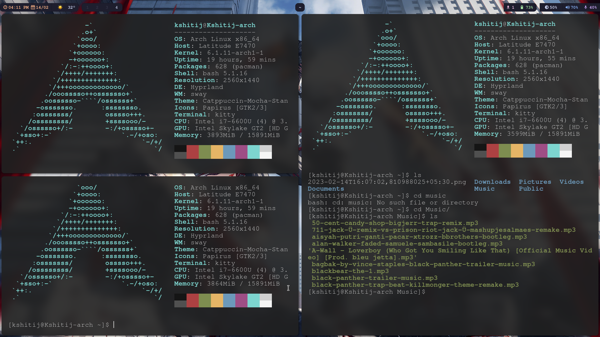
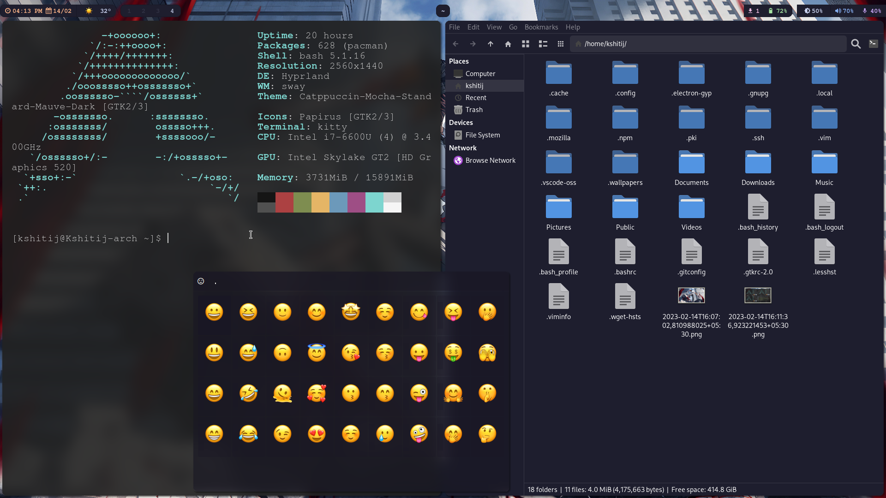

# Arch Linux using Hyprland
## Hyprland Dotfiles for Arch Linux 

This is my version of Arch Linux running Hyprland
I am running the following packages:
- dunst
- cava
- rofi
- swaylock
- waybar
- wlogout
- swaybg

Theme:
- GTK3/4 : Sweet Ambar Blue Dark v40
- Icon Theme : FLuent Icons Dark
- Cursors : Adwaita

---

---

---

## Installation 
Follw steps mentioned in [Arch-Hyprland Installation](Installation.md)

## Credits
- Hyrland [github](https://github.com/hyprwm/Hyprland)
- Chris Titus Tech [youtube](https://www.youtube.com/c/ChrisTitusTech)
- Linuxmobile [github](https://github.com/linuxmobile/hyprland-dots)

 Hyprland Dots is licensed under a <a rel="license" href="http://creativecommons.org/licenses/by-sa/4.0/">Creative Commons Attribution-ShareAlike 4.0 International License</a>.